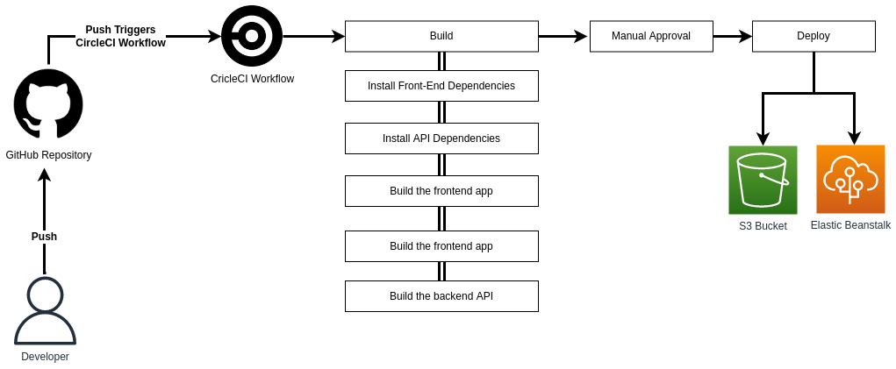

# Pipeline process

1. Developer commits code changes from their local repo to the GitHub repository. CircleCI is triggered automatically when code is pushed to master.
2. CircleCI triggers the build stage.
3. After the build is successfully completed CircleCI waits for manual approval for deployment.
4. CircleCI uses eb CLI and AWS CLI to authenticate to AWS and access resources.
5. CircleCI uses AWS CLI to upload the frontend files to Amazon S3 Bucket.
6. CircleCI uses eb CLI to deploy the API on Elastic Beanstalk.
